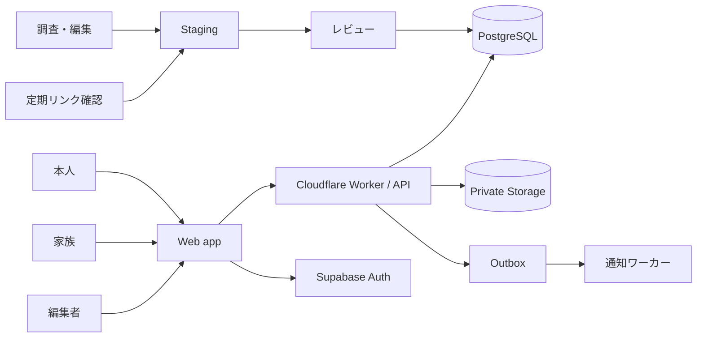
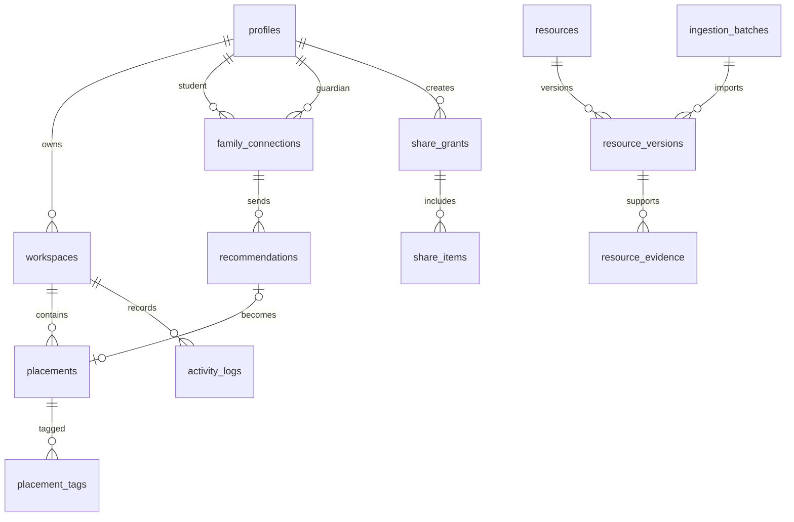

# シンボク サービス設計

更新日: 2026-09-12

## 解くべき問題

シンボクは情報を読むサイトではなく、本人が数年かけて見つけた情報・経験・考えを自分の地図へ取り込み、家族から届く情報も自分で採否を決められるサービスである。そのため、端末内の単一JSONではなく、本人の所有権、複数端末、家族との権限境界、掲載情報の更新履歴を一貫して扱う必要がある。

## 検討した構成

| 案 | 正しさ | 変更容易性 | 初期コスト | 致命傷になり得る点 |
| --- | --- | --- | --- | --- |
| 静的サイトを拡張 | 個人利用までは単純 | 共有・同期のたびに独自機構が増える | 小 | 継続的な家族共有とデータ更新の正本を持てない |
| モジュラーモノリス + PostgreSQL | トランザクションと権限制約を一か所で守れる | モジュール単位で後から分離できる | 中 | RLSとAPI認可を設計せずに混ぜると情報が漏れる |
| 機能別マイクロサービス | 個別に拡張できる | 境界が安定した後は高い | 大 | 現段階では分散トランザクションと運用負荷が価値を上回る |

採用はモジュラーモノリス。WebとAPIを1つのデプロイ単位にし、コード上では認証、本人の地図、家族接続、掲載情報、通知、編集管理を分ける。利用量や組織が増えて境界が実測できたモジュールだけを後から分離する。

## 採用構成

- **Web / API**: TypeScript strict、React Router のフルスタック構成を Cloudflare Workers に配備する。現在のES Modules版はUI仕様を確認するプロトタイプとして残し、画面ごとに移植する。
- **Database / Auth**: Supabase の PostgreSQL と Auth。本人・保護者・編集者は同じ認証基盤を使い、役割と接続関係はアプリのテーブルで管理する。
- **Files**: Supabase Storage の非公開バケット。写真はDBへData URLで保存せず、所有者を含むパスへ置く。
- **Background work**: 初期はGitHub Actionsの定期実行でリンク確認と鮮度レポートを作る。利用者向け通知が必要になった時点でoutboxをワーカーへ接続する。
- **Search**: PostgreSQLの全文検索と分類フィルターから始める。検索専用サービスやベクトル検索は、検索失敗ログと件数が必要性を示してから追加する。
- **Observability**: リクエストID、処理時間、結果コード、ジョブ結果を記録する。本人のメモ、検索文、写真URL、招待トークンをログへ出さない。

Cloudflare Workers は静的アセットとAPIを同じアプリとして配信できる。SupabaseはAuth、PostgreSQL、Storageを同じ権限モデルに寄せられ、PostgreSQLの制約とRLSで本人・家族・編集者の境界を検査できる。



## サービスの境界

### Identity

サインイン、セッション、プロフィール、退会を扱う。生年月日・学校名・住所は初期登録で求めず、学年と都道府県は任意の設定として分ける。匿名利用は今の端末保存で開始でき、同期を有効にするときだけアカウントを作る。

### Workspace

本人の地図、置きもの、タグ、今の考え、やったことを扱う。地図全体を1つのJSONとして上書きせず、置きもの単位で更新する。各更新は `revision` を持ち、古い画面からの上書きには409を返して再読込を促す。

### Family connection

本人が1回限りの招待を作り、家族が受け取る。招待トークンはハッシュだけをDBに保存し、有効期限、使用済み、取消済みを持つ。接続しても家族は本人の地図を読めない。最初に許可する操作は「おすすめを送る」だけとする。

### Recommendation inbox

家族のおすすめは受信箱に入り、本人が `new` / `later` / `placed` / `dismissed` を選ぶ。`placed` のときだけ本人の置きものを同じトランザクションで作る。送信者による削除は、本人の地図へ取り込んだ置きものを削除しない。

### Catalog and editorial

公開IDと版を分ける。公開済みIDは維持し、内容更新は新しい版としてレビューする。証拠、確認日、申込期限、リンク確認結果を版へ結びつける。利用者の保存データは安定IDを参照し、表示時に公開中の最新版を読む。

### Notification

画面内受信箱を正本にする。メール通知は本人・家族が個別に有効化した場合だけ送り、通知失敗でおすすめ本体を失わない。DB更新時に `outbox_events` を同じトランザクションへ書き、非同期処理が再試行する。

## 主要データモデル



主要テーブルと制約:

| テーブル | 主な列・制約 |
| --- | --- |
| `profiles` | `id auth.users FK`, `role`, `display_name`, `deleted_at` |
| `workspaces` | `id`, `owner_id unique`, `revision`, `created_at` |
| `placements` | `id`, `workspace_id`, `kind`, `source`, `resource_id`, `label`, `url`, `lane`, `x`, `revision`; URL/写真/カタログ参照の組合せをCHECK |
| `family_connections` | `student_id`, `guardian_id`, `status`, `created_at`, `revoked_at`; 組合せunique |
| `family_invites` | `token_hash unique`, `student_id`, `expires_at`, `used_at`, `revoked_at` |
| `recommendations` | `connection_id`, `sender_id`, `client_request_id`, `status`, `url`, `title`, `note`, `topic_id`, `verb_id`, `placement_id`; 送信者ごとのrequest IDをunique |
| `resources` | 変更しない公開ID、`published_version_id`, `archived_at` |
| `resource_versions` | 全掲載項目、`status draft/review/published/rejected/expired`, `version`, `created_by`, `reviewed_by`; resource/version unique |
| `resource_evidence` | `resource_version_id`, `source_url`, `checked_on`, `supports`, `open_questions` |
| `outbox_events` | `kind`, `aggregate_id`, `payload`, `available_at`, `attempts`, `processed_at`; idempotency key unique |

写真のオブジェクトキーは `users/{owner_id}/placements/{placement_id}/{file_id}` とし、DB上の所有者と一致する場合だけ操作できる。公開URLは作らず、短時間の署名付き取得を使う。

## 認可ルール

1. 本人は自分のworkspaceを読み書きできる。
2. 家族は接続中の本人へおすすめを送れ、自分が送ったおすすめの送達状態だけ読める。
3. 家族は、本人が別途作った `share_grant` の項目だけ読める。接続そのものは閲覧許可ではない。
4. 編集者は本人のworkspace、メモ、家族関係を読めない。掲載情報のdraft/reviewだけを扱う。
5. 管理用service keyはブラウザへ渡さない。外部公開する全テーブルでRLS、権限grant、許可・拒否テストをセットで持つ。
6. 招待の作成・受諾、recommendationからplacementへの変換、公開版の切替はDB関数またはAPI内トランザクションで行う。

## API

JSON APIは `/api/v1` に固定し、変更操作は `Idempotency-Key` とCSRF対策を持つ。ブラウザセッションはHTTP-only、Secure、SameSite cookieを優先する。

| Method | Path | 用途 |
| --- | --- | --- |
| `GET` | `/me` | セッション、役割、同期状態 |
| `GET/PATCH` | `/workspace` | 本人設定と現在のbrevision |
| `POST/PATCH/DELETE` | `/placements` | 置きもの単位の操作 |
| `POST` | `/family/invites` | 本人が一度きりの招待を作る |
| `POST` | `/family/invites/:token/accept` | 家族が接続する |
| `DELETE` | `/family/connections/:id` | どちらからでも接続を解除 |
| `GET/POST` | `/recommendations` | 役割に応じた受信・送信 |
| `POST` | `/recommendations/:id/place` | 本人が受信情報を地図へ置く |
| `PATCH` | `/recommendations/:id` | あとで見る・見送る |
| `GET` | `/catalog/resources` | 公開中の掲載情報を検索 |
| `POST` | `/editor/imports` | 編集者が下書きバッチを投入 |
| `POST` | `/editor/resources/:id/publish` | 別の編集者がレビュー後に公開 |

成功レスポンスは `data` と `requestId`、失敗は安定した `code`、利用者向け `message`、入力項目ごとの `fields` を返す。内部例外やSQLを返さない。

## 同期とオフライン

初期表示はサーバーのworkspace snapshotを取得し、IndexedDBへキャッシュする。オンライン中の変更は先に画面へ反映し、操作単位で送る。失敗時は未同期として明示し、成功したように扱わない。複数端末競合は `revision` で検出し、別項目なら再適用、同じ項目なら本人に新旧を見せる。

localStorage v2からの移行は、本人が「この端末の記録を同期する」を選んだ時だけ行う。インポート前に件数と対象を表示し、成功後もしばらく端末側を削除しない。移行を自動実行しない。

## 掲載情報の投入

現在の `data/knowledge.json` は初期データのseedとして使う。新規情報は次の経路で入れる。

```text
公式ページを調査
  → evidence付きJSON/CSV
  → import batch（draft固定）
  → スキーマ・重複・URL・関係を自動検証
  → 編集者レビュー
  → 別操作でpublish
  → 検索インデックス更新
  → 定期リンク確認と期限切れ候補
```

ハッカソン中は `wireframe/scripts/import-resources.mjs` が同じ境界をJSONに対して実行する。本番移行後は `ingestion_batches` と管理画面へ置き換え、入力ファイル、検証エラー、誰が公開したかを残す。

## 段階的な実装

### Build 25: 体験契約の確認

リンクで家族のおすすめを受け、本人の受信箱から野原へ置く。これはバックエンド完成形ではなく、文言・採否・タグ・出どころ表示の検証用。サーバー移行時もこの操作順は維持する。

### Build 26: サービス土台（完了）

TypeScriptワークスペース、Web/API、SQL migration、認証、CIを作成した。既存カタログは42件の公開済み情報をseedとして生成し、guest状態とメールリンク認証状態を切り替えられる。RLSのallow/denyテストも追加した。ローカルSupabaseの実行はDocker Desktopが使える環境で行う。

### Build 27: 本人のクラウドworkspace

placements、stances、logsを項目単位APIへ移し、端末データの明示インポートと複数端末復元を実装する。競合、通信失敗、退会・削除を確認する。

### Build 28: 家族接続

本人発行の一度きり招待、取消、家族のおすすめ送信、本人の受信箱、置く/あとで/見送るをDB化する。家族がworkspaceを読めないことを結合テストで固定する。

### Build 29: 編集・公開基盤

下書き投入、根拠表示、レビュー、公開版切替、期限・リンク監視を管理画面へ移す。公開済みIDと利用者のplacement参照を壊さない移行を検証する。

### Build 30: 通知と運用

outbox、メールの明示的opt-in、配信停止、監視、バックアップ復元訓練、データエクスポートと退会を実装する。

## 完了条件

- 家族接続後も、共有許可のない本人データを家族APIから取得できない。
- おすすめの重複送信、再試行、接続解除がデータを二重作成・消失させない。
- 同じ置きものを2端末で更新した競合を検出する。
- draft情報は公開検索に出ず、レビュー記録なしではpublishできない。
- 写真の他人読み取り、ID差し替え、期限切れ招待を拒否する。
- アカウント削除、家族接続解除、写真削除、データexportを実機で確認する。
- DBバックアップだけで写真が復元できるとは扱わず、Storageを含む復旧手順を試験する。

## 参照

- [Cloudflare Workers full-stack applications](https://developers.cloudflare.com/workers/static-assets/routing/full-stack-application/)
- [Supabase Auth architecture](https://supabase.com/docs/guides/auth/architecture)
- [Supabase Row Level Security](https://supabase.com/docs/guides/database/postgres/row-level-security)
- [Supabase Storage access control](https://supabase.com/docs/guides/storage/security/access-control)
- [Supabase backups](https://supabase.com/docs/guides/platform/backups)
- [Cloudflare Turnstile server-side validation](https://developers.cloudflare.com/turnstile/get-started/server-side-validation/)
