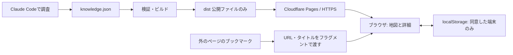

# システム構成と公開方法

## 今回の決定

ハッカソンの公開版は **Cloudflare Pagesの静的サイト** とする。現行のES ModulesとCSSを継続し、UIの全面的なフレームワーク移行は行わない。個人データは明示的な同意によるlocalStorage保存。アカウント、端末間同期、サーバー上の個人データ保存、実行時AIは今回の公開範囲に含めない。



- 公開情報はJSONを正本とし、ビルドで `knowledge-data.mjs` に変換。実行時のDB問い合わせはない。
- URL取り込みは本文をスクレイピングせず、確認画面で追加先を選ぶ。ブックマークレットは `#personal?captureUrl=...` のフラグメントを使い、取り込み対象のURL・タイトルを配信サーバーへのリクエストパスに含めない。
- 名前やURLが届いても自動保存しない。ブラウザ／サイトの制限でブックマークレットを実行できない場合は貼り付けで取り込む。
- 保護者共有のNode APIはローカルに残すが、機能フラグはオフ。公開版にAPI・秘密情報・`.data`・テストコードを配布しない。
- 端末保存をオンにしたデータは同一オリジン内。localhostから本番URLへ自動では移らない。別ブラウザ・別端末・別プレビューURLも別データ。複数タブの同時編集の競合解決は未実装で、同時編集を前提にしない。

## ビルド

ワークスペースのルートで実行する。

```sh
npm --prefix wireframe run check
npm --prefix wireframe test
npm --prefix wireframe run build
```

出力は `wireframe/dist/`。buildは入口HTMLとES Modulesの参照をたどって必要なファイルだけをコピーする。`knowledge.json`のdraftは生成物に入れない。`_headers`も生成し、MIME、CSP、キャッシュ再検証、referrer制限を設定する。

Nodeは既存コードで検証済みの実行環境を使用。アプリ用の追加npm依存はない。公開先にNodeサーバーは必要ない。

## 初回公開: Direct Upload

CloudflareアカウントでWorkers & Pagesを開き、PagesのDirect Uploadプロジェクトを作る。`wireframe/dist` の中身をアップロードする。プロジェクト名は公開担当者が指定する。生成されたHTTPSのURLで次の確認を行う。

CLIを使う場合は、Wranglerを利用できる環境で以下を実行する。`YOUR_PROJECT_NAME` は作成した実際のプロジェクト名に置き換える。この資料の作成時点では、ログイン・プロジェクト作成・本番公開は実行していない。

```sh
npx wrangler login
npx wrangler pages project create YOUR_PROJECT_NAME
npx wrangler pages deploy wireframe/dist --project-name YOUR_PROJECT_NAME
```

Direct Uploadを選ぶ理由は、現在この作業フォルダにGitリポジトリがなく、ビルドした公開ファイルだけをアップロードできるため。Git連携に移る場合は新しいプロジェクト構成を検討する。Direct UploadとGit連携は後から自由に切り替えられるものとして扱わない。

公式仕様を確認した資料：
- [Direct Upload](https://developers.cloudflare.com/pages/get-started/direct-upload/)
- [Wrangler Pagesコマンド](https://developers.cloudflare.com/workers/wrangler/commands/pages/)
- [静的ファイルのヘッダー設定](https://developers.cloudflare.com/pages/configuration/headers/)
- [Git integration](https://developers.cloudflare.com/pages/get-started/git-integration/)

## 公開後の確認

1. `/#personal` で初回表示。音楽→楽しみ方→活動→メモを同じ画面で開ける。
2. 海→生き物→森・川へのつながりを開ける。未掲載の情報を実在の募集として表示しない。
3. 端末保存をオンにしてテスト用メモを保存し、再読み込みで復元。確認後、自分のテストデータだけ削除する。
4. 公開URLで作成した取り込みブックマークからタイトルとURLを受け取れるか、実際に使うPCブラウザで確認する。
5. `.mjs` がJavaScriptとして配信され、ブラウザエラーがない。390pxとPCで地図と詳細が収まる。
6. `/server.mjs`、`/family-api.mjs`、`/.data/`、`/data/knowledge.json` は公開対象外。404になることを確認する。

更新は同じビルド手順→プレビュー確認→同じPagesプロジェクトへアップロード。秘密情報が混じるため、wireframeフォルダ全体やdevcampフォルダ全体をアップロードしない。

## 次の段階

端末間同期や保護者共有を再開する時は、認証、共有権限、招待失効、削除、競合解決を設計したうえでAPIとDBを追加する。その段階でCloudflare Workers + D1を候補として検討する。現在のNodeのファイル保存APIを、そのまま静的ホストに置けば動くとは扱わない。
